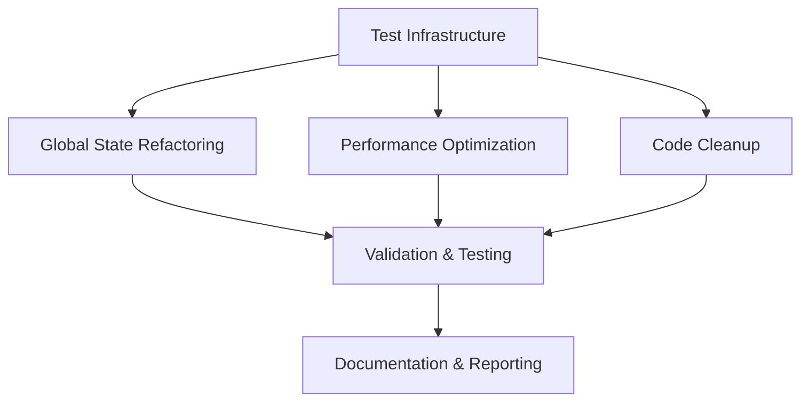

# Design Document: iweb Portfolio Improvements

## Overview

This design document outlines the technical approach for improving the iweb Portfolio project from A- (92/100) to A+ (98/100). The improvements are organized into four priority areas: Test Coverage Enhancement, Global State Refactoring, Performance Optimization, and Code Cleanup. Each area addresses specific technical debt and quality concerns while maintaining backward compatibility and production stability.

The design follows a phased approach where each improvement area can be implemented independently, allowing for incremental progress and validation. The test infrastructure improvements will be implemented first to enable validation of subsequent changes.

## Architecture

### System Components

The improvement system consists of four main components:

1. **Test Infrastructure Layer**
   - Property-based testing framework (fast-check)
   - Unit testing framework (Vitest)
   - Coverage reporting system
   - Test utilities and mocks

2. **Global State Management Layer**
   - Namespace consolidation module (window.AKS)
   - Migration compatibility layer
   - Deprecation warning system

3. **Performance Optimization Layer**
   - React/Preact evaluation module
   - Three.js tree-shaking configuration
   - Bundle analysis tools

4. **Code Modernization Layer**
   - API deprecation scanner
   - Module system migration
   - Linting rule updates

### Component Interactions



## Components and Interfaces

### 1. Test Infrastructure

#### fast-check Integration

```javascript
// test-utils/property-generators.js
import fc from 'fast-check';

export const arbitraries = {
  // Logger test generators
  logLevel: () => fc.constantFrom('error', 'warn', 'info', 'debug'),
  logMessage: () => fc.string({ minLength: 1, maxLength: 100 }),
  
  // Timer test generators
  delay: () => fc.integer({ min: 0, max: 1000 }),
  
  // Cookie test generators
  cookieName: () => fc.stringMatching(/^[a-zA-Z0-9_-]+$/),
  cookieValue: () => fc.string({ minLength: 0, maxLength: 100 }),
  cookieDays: () => fc.integer({ min: 1, max: 365 }),
  
  // Array test generators
  numberArray: () => fc.array(fc.integer(), { minLength: 0, maxLength: 100 }),
  
  // Event test generators
  eventType: () => fc.constantFrom(...Object.values(EVENTS)),
  eventDetail: () => fc.oneof(fc.constant(null), fc.object()),
  
  // Section test generators
  sectionId: () => fc.stringMatching(/^[a-z][a-z0-9-]*$/),
};
```

#### Test Configuration

```javascript
// vitest.config.js (updated)
export default defineConfig({
  test: {
    // ... existing config
    
    // Property-based testing configuration
    propertyTesting: {
      iterations: 100, // Minimum iterations per property test
      seed: Date.now(), // Reproducible randomness
    },
    
    // Coverage thresholds
    coverage: {
      thresholds: {
        lines: 60,
        functions: 60,
        branches: 60,
        statements: 60,
      },
    },
  },
});
```

### 2. Global State Management

#### Namespace Consolidation

```javascript
// content/utils/global-state.js

/**
 * Centralized global state management
 * All global variables are consolidated under window.AKS
 */

// Initialize namespace
if (typeof window !== 'undefined' && !window.AKS) {
  window.AKS = {
    // Three.js Earth system
    threeEarthCleanup: null,
    threeEarthSystem: null,
    forceThreeEarth: false,
    
    // Core systems
    announce: null,
    SectionLoader: null,
    mainDelegatedRemove: null,
    
    // Robot Companion
    robotCompanionTexts: null,
    
    // YouTube integration
    youtubeChannelId: null,
    youtubeChannelHandle: null,
    
    // Internal flags
    _migrationWarningsShown: new Set(),
  };
}

/**
 * Migration helper with deprecation warnings
 */
export function createDeprecatedProxy(oldPath, newPath, value) {
  return {
    get() {
      if (!window.AKS._migrationWarningsShown.has(oldPath)) {
        console.warn(
          `[DEPRECATED] ${oldPath} is deprecated. Use ${newPath} instead.`
        );
        window.AKS._migrationWarningsShown.add(oldPath);
      }
      return value;
    },
    set(newValue) {
      if (!window.AKS._migrationWarningsShown.has(oldPath)) {
        console.warn(
          `[DEPRECATED] ${oldPath} is deprecated. Use ${newPath} instead.`
        );
        window.AKS._migrationWarningsShown.add(oldPath);
      }
      return newValue;
    },
  };
}

/**
 * Setup backward compatibility proxies
 * These will be removed in a future release
 */
export function setupBackwardCompatibility() {
  if (typeof globalThis === 'undefined') return;
  
  // Proxy old globalThis properties to new window.AKS properties
  Object.defineProperty(globalThis, '__threeEarthCleanup', 
    createDeprecatedProxy(
      'globalThis.__threeEarthCleanup',
      'window.AKS.threeEarthCleanup',
      window.AKS.threeEarthCleanup
    )
  );
  
  Object.defineProperty(globalThis, 'announce',
    createDeprecatedProxy(
      'globalThis.announce',
      'window.AKS.announce',
      window.AKS.announce
    )
  );
  
  // ... similar proxies for other global variables
}

/**
 * Access helpers for type safety
 */
export const GlobalState = {
  get threeEarthCleanup() {
    return window.AKS?.threeEarthCleanup;
  },
  set threeEarthCleanup(value) {
    if (window.AKS) window.AKS.threeEarthCleanup = value;
  },
  
  get announce() {
    return window.AKS?.announce;
  },
  set announce(value) {
    if (window.AKS) window.AKS.announce = value;
  },
  
  // ... similar getters/setters for other properties
};
```

### 3. Performance Optimization

#### React to Preact Migration

```javascript
// vite.config.js (updated for Preact)
import { defineConfig } from 'vite';
import preact from '@preact/preset-vite';

export default defineConfig({
  plugins: [preact()],
  
  resolve: {
    alias: {
      // Alias React to Preact for compatibility
      'react': 'preact/compat',
      'react-dom': 'preact/compat',
      'react/jsx-runtime': 'preact/jsx-runtime',
    },
  },
  
  build: {
    rollupOptions: {
      output: {
        manualChunks: {
          // Separate Preact into its own chunk
          'preact-vendor': ['preact', 'preact/compat'],
        },
      },
    },
  },
});
```

#### Three.js Tree-Shaking

```javascript
// vite.config.js (Three.js optimization)
export default defineConfig({
  build: {
    rollupOptions: {
      output: {
        manualChunks(id) {
          // Separate Three.js into its own chunk
          if (id.includes('three')) {
            return 'three-vendor';
          }
        },
      },
    },
  },
  
  optimizeDeps: {
    include: [
      // Pre-bundle Three.js for faster dev server
      'three',
    ],
  },
});
```

```javascript
// content/components/three-earth/three-earth.js (optimized imports)

// Before: Import entire Three.js
// import * as THREE from 'three';

// After: Import only needed modules
import { WebGLRenderer } from 'three/src/renderers/WebGLRenderer.js';
import { Scene } from 'three/src/scenes/Scene.js';
import { PerspectiveCamera } from 'three/src/cameras/PerspectiveCamera.js';
import { SphereGeometry } from 'three/src/geometries/SphereGeometry.js';
import { MeshStandardMaterial } from 'three/src/materials/MeshStandardMaterial.js';
import { Mesh } from 'three/src/objects/Mesh.js';
import { AmbientLight } from 'three/src/lights/AmbientLight.js';
import { DirectionalLight } from 'three/src/lights/DirectionalLight.js';
import { TextureLoader } from 'three/src/loaders/TextureLoader.js';

// This approach enables tree-shaking of unused Three.js modules
```

### 4. Code Modernization

#### MediaQueryList API Update

```javascript
// vitest.setup.js (before)
Object.defineProperty(window, 'matchMedia', {
  writable: true,
  value: (query) => ({
    matches: false,
    media: query,
    onchange: null,
    addListener: () => {}, // deprecated
    removeListener: () => {}, // deprecated
    addEventListener: () => {},
    removeEventListener: () => {},
    dispatchEvent: () => {},
  }),
});

// vitest.setup.js (after)
Object.defineProperty(window, 'matchMedia', {
  writable: true,
  value: (query) => ({
    matches: false,
    media: query,
    onchange: null,
    // Removed deprecated methods
    addEventListener: () => {},
    removeEventListener: () => {},
    dispatchEvent: () => {},
  }),
});
```

#### Module System Migration

```json
// package.json (before)
{
  "type": "commonjs"
}

// package.json (after)
{
  "type": "module"
}
```

## Data Models

### Test Result Model

```typescript
interface PropertyTestResult {
  propertyNumber: number;
  propertyName: string;
  requirementIds: string[]; // e.g., ["1.2", "1.3"]
  iterations: number;
  passed: boolean;
  counterexample?: any;
  seed?: number;
  executionTime: number;
}

interface CoverageReport {
  lines: {
    total: number;
    covered: number;
    percentage: number;
  };
  functions: {
    total: number;
    covered: number;
    percentage: number;
  };
  branches: {
    total: number;
    covered: number;
    percentage: number;
  };
  statements: {
    total: number;
    covered: number;
    percentage: number;
  };
  files: {
    [filePath: string]: FileCoverage;
  };
}
```

### Performance Metrics Model

```typescript
interface BundleAnalysis {
  before: {
    totalSize: number; // bytes
    gzippedSize: number;
    chunks: ChunkInfo[];
  };
  after: {
    totalSize: number;
    gzippedSize: number;
    chunks: ChunkInfo[];
  };
  improvement: {
    sizeReduction: number; // bytes
    percentageReduction: number;
  };
}

interface ChunkInfo {
  name: string;
  size: number;
  gzippedSize: number;
  modules: string[];
}
```

### Migration Status Model

```typescript
interface MigrationStatus {
  globalVariables: {
    [oldPath: string]: {
      newPath: string;
      migrated: boolean;
      usageCount: number;
      deprecationWarningsShown: number;
    };
  };
  backwardCompatibilityActive: boolean;
  estimatedRemovalDate: string;
}
```

## Correctness Properties

*A property is a characteristic or behavior that should hold true across all valid executions of a system—essentially, a formal statement about what the system should do. Properties serve as the bridge between human-readable specifications and machine-verifiable correctness guarantees.*

### Property 1: Logger Level Filtering
*For any* log message and log level, when the logger is configured with a specific level, only messages at or above that level should be output to the console.
**Validates: Requirements 1.2**

### Property 2: Event System Dispatch
*For any* event type and event detail, when fire() is called with a valid target, the event should be dispatched correctly; when called with an invalid target, it should handle errors gracefully without crashing.
**Validates: Requirements 1.14, 1.15**

### Property 3: Timer Management Tracking
*For any* sequence of setTimeout and setInterval calls, the TimerManager should track all active timers, and calling clearAll() should result in zero active timers and all callbacks being cancelled.
**Validates: Requirements 1.5, 1.6, 1.7**

### Property 4: Cookie Round-Trip Consistency
*For any* valid cookie name and value, setting a cookie then immediately getting it should return the same value; deleting a cookie should make it unretrievable.
**Validates: Requirements 1.8, 1.9, 1.10**

### Property 5: Throttle Rate Limiting
*For any* function and throttle limit, when the function is called multiple times rapidly, it should execute at most once per throttle period.
**Validates: Requirements 1.11**

### Property 6: Debounce Execution Delay
*For any* function and debounce delay, when the function is called multiple times in quick succession, only the last call should execute after the delay period.
**Validates: Requirements 1.12**

### Property 7: Shuffle Element Preservation
*For any* array, shuffling it should produce an array with the same elements (same length, same values, possibly different order).
**Validates: Requirements 1.13**

### Property 8: IntersectionObserver Callback Triggering
*For any* element and intersection callback, when the element intersects the viewport, the callback should be triggered with the correct element.
**Validates: Requirements 1.16**

### Property 9: Lazy Load Observer Idempotence
*For any* element, observing it with createLazyLoadObserver() should trigger the callback exactly once when it intersects, regardless of how many times it intersects afterward.
**Validates: Requirements 1.17**

### Property 10: Section Tracker Change Detection
*For any* set of sections, when a different section becomes the most visible, the SectionTracker should dispatch a section change event with the correct section ID.
**Validates: Requirements 1.18**

### Property 11: Menu State Transitions
*For any* valid sequence of menu actions (open, close, toggle), the menu state should transition correctly and the DOM should reflect the current state.
**Validates: Requirements 1.19**

### Property 12: Search Result Filtering
*For any* search query and dataset, the search results should only include items that match the query criteria.
**Validates: Requirements 1.20**

### Property 13: Backward Compatibility Preservation
*For any* migrated global variable, accessing it through the old path (globalThis.X) should return the same value as accessing it through the new path (window.AKS.X).
**Validates: Requirements 2.13**

### Property 14: Deprecation Warning Emission
*For any* deprecated global variable access, the first access should emit a deprecation warning, and subsequent accesses should not emit duplicate warnings.
**Validates: Requirements 2.14**

### Property 15: Behavioral Equivalence After Optimization
*For any* user interaction or system operation, the behavior after performance optimizations (Preact migration, Three.js tree-shaking) should be functionally equivalent to the behavior before optimizations.
**Validates: Requirements 3.3, 3.8, 4.7**

### Property 16: Test Tag Format Compliance
*For any* property-based test, the test description should match the format "Feature: {feature_name}, Property {number}: {property_text}".
**Validates: Requirements 5.2**

### Property 17: Test Error Message Clarity
*For any* failing test, the error message should include the test name, the failure reason, and a stack trace.
**Validates: Requirements 5.7**

### Property 18: Test Isolation
*For any* pair of tests, running them in sequence should produce the same results as running them individually, demonstrating that state is properly cleaned up between tests.
**Validates: Requirements 5.10**


## Error Handling

### Test Execution Errors

**Strategy**: Graceful degradation with clear error reporting

```javascript
// test-utils/error-handling.js

export function safePropertyTest(testFn, propertyName) {
  return async () => {
    try {
      await testFn();
    } catch (error) {
      // Enhance error message with property context
      const enhancedError = new Error(
        `Property test failed: ${propertyName}\n` +
        `Original error: ${error.message}\n` +
        `Stack: ${error.stack}`
      );
      throw enhancedError;
    }
  };
}

export function handleCounterexample(counterexample, propertyName) {
  console.error(
    `Counterexample found for ${propertyName}:`,
    JSON.stringify(counterexample, null, 2)
  );
  
  // Save counterexample for reproduction
  if (typeof localStorage !== 'undefined') {
    const key = `counterexample_${propertyName}`;
    localStorage.setItem(key, JSON.stringify(counterexample));
  }
}
```

### Migration Errors

**Strategy**: Fail-safe with deprecation warnings

```javascript
// content/utils/global-state.js

export function safeGlobalAccess(path, fallback = null) {
  try {
    const parts = path.split('.');
    let current = window;
    
    for (const part of parts) {
      if (current && typeof current === 'object' && part in current) {
        current = current[part];
      } else {
        console.warn(`Global access failed: ${path} not found`);
        return fallback;
      }
    }
    
    return current;
  } catch (error) {
    console.error(`Error accessing global: ${path}`, error);
    return fallback;
  }
}
```

### Performance Optimization Errors

**Strategy**: Rollback capability with validation

```javascript
// scripts/performance-validation.js

export async function validateOptimization(testSuite) {
  const results = {
    passed: [],
    failed: [],
    warnings: [],
  };
  
  for (const test of testSuite) {
    try {
      const result = await test.run();
      
      if (result.passed) {
        results.passed.push(test.name);
      } else {
        results.failed.push({
          name: test.name,
          error: result.error,
          suggestion: 'Consider rolling back this optimization',
        });
      }
    } catch (error) {
      results.failed.push({
        name: test.name,
        error: error.message,
        suggestion: 'Optimization may have broken functionality',
      });
    }
  }
  
  if (results.failed.length > 0) {
    throw new Error(
      `Optimization validation failed:\n` +
      results.failed.map(f => `  - ${f.name}: ${f.error}`).join('\n')
    );
  }
  
  return results;
}
```

### Build Errors

**Strategy**: Early detection with clear feedback

```javascript
// vite.config.js

export default defineConfig({
  build: {
    rollupOptions: {
      onwarn(warning, warn) {
        // Fail on certain warnings
        if (warning.code === 'CIRCULAR_DEPENDENCY') {
          throw new Error(`Circular dependency detected: ${warning.message}`);
        }
        
        // Log other warnings
        warn(warning);
      },
    },
  },
});
```

## Testing Strategy

### Dual Testing Approach

This project uses a complementary dual testing approach:

1. **Unit Tests**: Verify specific examples, edge cases, and error conditions
2. **Property Tests**: Verify universal properties across all inputs

Both are necessary for comprehensive coverage. Unit tests catch concrete bugs, while property tests verify general correctness.

### Property-Based Testing Configuration

**Library**: fast-check (https://github.com/dubzzz/fast-check)

**Rationale**: fast-check is the leading property-based testing library for JavaScript/TypeScript, with excellent Vitest integration and comprehensive arbitrary generators.

**Configuration**:
```javascript
// vitest.config.js
export default defineConfig({
  test: {
    // Minimum 100 iterations per property test
    propertyTesting: {
      iterations: 100,
      seed: Date.now(), // Reproducible randomness
    },
  },
});
```

**Test Tagging**:
Each property test MUST include a comment tag:
```javascript
// Feature: iweb-portfolio-improvements, Property 1: Logger Level Filtering
test('logger filters messages by level', () => {
  fc.assert(
    fc.property(
      arbitraries.logLevel(),
      arbitraries.logMessage(),
      (level, message) => {
        // Test implementation
      }
    ),
    { numRuns: 100 }
  );
});
```

### Test Organization

```
content/
  utils/
    shared-utilities.js
    shared-utilities.test.js        # Unit tests
    shared-utilities.properties.js  # Property tests
  components/
    menu/
      menu.js
      menu.test.js
      menu.properties.js
```

### Coverage Goals

- **Target**: 60-80% coverage for utility modules
- **Priority**: Focus on critical paths and complex logic
- **Exclusions**: Test files, configuration, build artifacts

### Test Execution

```bash
# Run all tests
npm test

# Run with coverage
npm run test:coverage

# Run with UI
npm run test:ui

# Run specific test file
npm test shared-utilities.test.js

# Run property tests only
npm test -- --grep "Property [0-9]+"
```

### Performance Testing

**Bundle Size Validation**:
```javascript
// scripts/validate-bundle-size.js

import { readFileSync } from 'fs';
import { gzipSync } from 'zlib';

export function validateBundleSize(filePath, maxSize) {
  const content = readFileSync(filePath);
  const gzipped = gzipSync(content);
  const size = gzipped.length;
  
  if (size > maxSize) {
    throw new Error(
      `Bundle size ${size} bytes exceeds maximum ${maxSize} bytes`
    );
  }
  
  return { size, maxSize, passed: true };
}

// Usage in tests
test('React to Preact migration reduces bundle size', () => {
  const beforeSize = 45000; // 45KB
  const afterSize = validateBundleSize('dist/preact-vendor.js', 20000).size;
  
  expect(afterSize).toBeLessThan(beforeSize - 25000); // At least 25KB reduction
});
```

## Implementation Phases

### Phase 1: Test Infrastructure (Priority 1)
1. Install fast-check dependency
2. Create test utilities and arbitraries
3. Configure Vitest for property-based testing
4. Set up coverage thresholds
5. Create example property tests

**Success Criteria**: 
- fast-check integrated and working
- Coverage reporting configured
- At least 3 property tests passing

### Phase 2: Test Coverage Enhancement (Priority 1)
1. Write property tests for Logger
2. Write property tests for TimerManager
3. Write property tests for CookieManager
4. Write property tests for utility functions
5. Write property tests for IntersectionObserver utilities
6. Write property tests for SectionTracker
7. Write tests for menu.js
8. Write tests for search.js

**Success Criteria**:
- 60-80% coverage achieved
- All 18 correctness properties implemented
- All tests passing

### Phase 3: Global State Refactoring (Priority 2)
1. Create window.AKS namespace
2. Implement backward compatibility layer
3. Migrate global variables one by one
4. Add deprecation warnings
5. Update all references to use new namespace
6. Test backward compatibility

**Success Criteria**:
- All global variables consolidated
- Backward compatibility working
- Deprecation warnings showing
- All tests passing

### Phase 4: Performance Optimization (Priority 3)
1. Measure baseline bundle sizes
2. Install Preact and preact/compat
3. Update Vite configuration for Preact
4. Test Robot Companion with Preact
5. Optimize Three.js imports
6. Measure optimized bundle sizes
7. Validate functionality preservation

**Success Criteria**:
- Bundle size reduced by at least 30KB
- All features working correctly
- Performance report generated

### Phase 5: Code Cleanup (Priority 4)
1. Update vitest.setup.js MediaQueryList API
2. Change package.json to "type": "module"
3. Verify all imports/exports work
4. Update ESLint configuration
5. Run all tests to verify no regressions
6. Update CHANGELOG.md

**Success Criteria**:
- No deprecated APIs in use
- Module system modernized
- All tests passing
- Documentation updated

### Phase 6: Documentation and CI (Final)
1. Create performance report
2. Write migration guides
3. Update README.md
4. Set up CI configuration
5. Configure coverage reporting in CI
6. Create final summary report

**Success Criteria**:
- All documentation complete
- CI running successfully
- Project score improved to A+ (98/100)

## Design Decisions and Rationales

### Why fast-check for Property-Based Testing?

**Decision**: Use fast-check instead of implementing property-based testing from scratch.

**Rationale**:
- Mature library with 5+ years of development
- Excellent TypeScript support
- Comprehensive arbitrary generators (strings, numbers, arrays, objects, etc.)
- Shrinking capability (finds minimal counterexamples)
- Good Vitest integration
- Active maintenance and community support

**Alternatives Considered**:
- jsverify: Less actively maintained, smaller community
- testcheck-js: Archived, no longer maintained
- Custom implementation: Too much effort, reinventing the wheel

### Why Preact over React?

**Decision**: Migrate Robot Companion from React to Preact.

**Rationale**:
- 42KB size reduction (React 45KB → Preact 3KB gzipped)
- Compatible API via preact/compat
- Same developer experience
- Better performance (faster rendering)
- Robot Companion is a simple component, low migration risk

**Alternatives Considered**:
- Keep React: Simpler but misses significant optimization opportunity
- Vanilla JS: More work, loses component benefits
- Other frameworks (Vue, Svelte): Larger migration effort

### Why Namespace Consolidation?

**Decision**: Consolidate all global variables into window.AKS.

**Rationale**:
- Prevents namespace pollution
- Reduces risk of conflicts with third-party libraries
- Easier to track and manage global state
- Better for debugging (all globals in one place)
- Industry best practice

**Alternatives Considered**:
- Keep scattered globals: Maintains status quo but doesn't solve the problem
- Use ES modules only: Not always possible for truly global state
- Multiple namespaces: More complex, harder to manage

### Why Gradual Migration with Backward Compatibility?

**Decision**: Implement backward compatibility layer during migration.

**Rationale**:
- Reduces risk of breaking production
- Allows incremental migration
- Provides time to update all references
- Enables deprecation warnings for tracking
- Can be removed in future release

**Alternatives Considered**:
- Big bang migration: Higher risk, harder to debug issues
- No backward compatibility: Would break existing code immediately

## References and Resources

### Property-Based Testing
- [fast-check documentation](https://github.com/dubzzz/fast-check)
- [Property-Based Testing with fast-check tutorial](https://www.krython.com/tutorial/typescript/property-based-testing-fast-check)
- [How to get started with property-based testing in JavaScript](https://jrsinclair.com/articles/2021/how-to-get-started-with-property-based-testing-in-javascript-with-fast-check)

### Performance Optimization
- [Preact vs React: Bundle Size Comparison](https://markaicode.com/preact-vs-react-bundle-size-performance-guide/)
- [Three.js Tree-Shaking Discussion](https://discourse.threejs.org/t/bundle-size-reduction/38602)
- [Vite Build Optimization Guide](https://markaicode.com/vite-6-build-optimization-guide/)

### Testing Best Practices
- [Vitest Documentation](https://vitest.dev/)
- [Testing Library Best Practices](https://testing-library.com/docs/queries/about)

*Content was rephrased for compliance with licensing restrictions*
