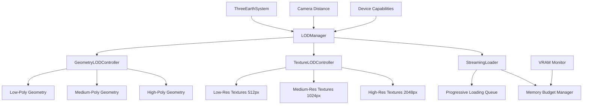

# Design Document: Three.js LOD (Level of Detail) System für Earth Visualization

## Overview

Dieses Design implementiert ein dynamisches Level-of-Detail (LOD) System für die Three.js Earth Visualization, um die Performance auf mobilen Endgeräten zu optimieren. Das System passt die Geometrie-Komplexität und Texturauflösung basierend auf der Kamera-Distanz dynamisch an. Bei großer Entfernung wird eine Low-Poly-Sphäre mit niedrig aufgelösten Texturen gerendert; bei Annäherung werden hochauflösende Geometrien und Texturen progressiv nachgeladen. Dies reduziert VRAM-Verbrauch und Initiallast erheblich.

## Architecture

Das LOD-System integriert sich nahtlos in die bestehende `ThreeEarthSystem`-Klasse und erweitert diese um drei neue Komponenten:



````

## Main Algorithm/Workflow

```mermaid
sequenceDiagram
    participant Camera
    participant LODManager
    participant GeometryController
    participant TextureController
    participant StreamingLoader
    participant Renderer

    Camera->>LODManager: distance changed
    LODManager->>LODManager: calculate LOD level
    LODManager->>GeometryController: request geometry for level
    LODManager->>TextureController: request textures for level

    alt Geometry not loaded
        GeometryController->>StreamingLoader: queue geometry load
        StreamingLoader->>StreamingLoader: check memory budget
        StreamingLoader-->>GeometryController: geometry ready
    end

    alt Textures not loaded
        TextureController->>StreamingLoader: queue texture load
        StreamingLoader->>StreamingLoader: check memory budget
        StreamingLoader-->>TextureController: textures ready
    end

    GeometryController-->>LODManager: geometry updated
    TextureController-->>LODManager: textures updated
    LODManager->>Renderer: trigger render
````

````

## Components and Interfaces

### Component 1: LODManager

**Purpose**: Central coordinator for LOD system, manages level transitions based on camera distance and device capabilities

**Interface**:
```javascript
class LODManager {
  constructor(scene, camera, deviceCapabilities)

  // Core methods
  update(deltaTime)
  getCurrentLevel()
  setLODLevel(level, force = false)

  // Configuration
  setDistanceThresholds(thresholds)
  enableAutoLOD(enabled)

  // Cleanup
  dispose()
}
````

**Responsibilities**:

- Monitor camera distance to Earth center
- Calculate appropriate LOD level based on distance thresholds
- Coordinate geometry and texture transitions
- Respect device capability constraints
- Provide smooth transitions between LOD levels

### Component 2: GeometryLODController

**Purpose**: Manages geometry complexity levels and handles geometry swapping

**Interface**:

```javascript
class GeometryLODController {
  constructor(earthMesh, cloudsMesh, moonMesh)

  // Geometry management
  async loadGeometry(level)
  switchGeometry(level)
  getGeometryForLevel(level)

  // Memory management
  disposeUnusedGeometries()
  getMemoryUsage()

  // Cleanup
  dispose()
}
```

**Responsibilities**:

- Create and cache geometry at different detail levels
- Swap mesh geometries without recreating materials
- Dispose unused geometries to free VRAM
- Track memory usage per geometry level

### Component 3: TextureLODController

**Purpose**: Manages texture resolution levels and progressive loading

**Interface**:

```javascript
class TextureLODController {
  constructor(materials, texturePaths)

  // Texture management
  async loadTextures(level)
  switchTextures(level)
  getTexturesForLevel(level)

  // Progressive loading
  preloadNextLevel(level)

  // Memory management
  disposeUnusedTextures()
  getMemoryUsage()

  // Cleanup
  dispose()
}
```

**Responsibilities**:

- Load textures at different resolutions (512px, 1024px, 2048px)
- Apply textures to materials without recreating them
- Preload next LOD level textures in background
- Dispose unused textures to free VRAM
- Track memory usage per texture set

### Component 4: StreamingLoader

**Purpose**: Manages asynchronous loading queue with memory budget constraints

**Interface**:

```javascript
class StreamingLoader {
  constructor(memoryBudget)

  // Queue management
  queueLoad(resource, priority)
  cancelLoad(resourceId)

  // Memory management
  checkMemoryBudget()
  getCurrentMemoryUsage()
  setMemoryBudget(budget)

  // Events
  on(event, callback)
  off(event, callback)

  // Cleanup
  dispose()
}
```

**Responsibilities**:

- Queue geometry and texture loads by priority
- Enforce memory budget limits (prevent OOM)
- Cancel pending loads when LOD level changes
- Emit events for load completion/failure
- Track total VRAM usage across all resources

## Data Models

### Model 1: LODLevel

```javascript
/**
 * @typedef {Object} LODLevel
 * @property {number} level - LOD level (0=LOW, 1=MEDIUM, 2=HIGH)
 * @property {number} minDistance - Minimum camera distance for this level
 * @property {number} maxDistance - Maximum camera distance for this level
 * @property {GeometryConfig} geometry - Geometry configuration
 * @property {TextureConfig} textures - Texture configuration
 * @property {boolean} enabled - Whether this level is enabled for current device
 */
```

**Validation Rules**:

- `level` must be 0, 1, or 2
- `minDistance` must be less than `maxDistance`
- `minDistance` must be greater than 0
- Distance ranges must not overlap between levels

### Model 2: GeometryConfig

```javascript
/**
 * @typedef {Object} GeometryConfig
 * @property {number} segments - Sphere segment count
 * @property {number} estimatedVRAM - Estimated VRAM usage in MB
 * @property {boolean} cached - Whether geometry is currently cached
 */
```

**Validation Rules**:

- `segments` must be power of 2 (16, 32, 64, 128)
- `segments` must be between 16 and 128
- `estimatedVRAM` must be positive number

### Model 3: TextureConfig

```javascript
/**
 * @typedef {Object} TextureConfig
 * @property {number} resolution - Texture resolution (512, 1024, 2048)
 * @property {string[]} paths - Array of texture file paths
 * @property {number} estimatedVRAM - Estimated VRAM usage in MB
 * @property {boolean} cached - Whether textures are currently cached
 * @property {boolean} preloaded - Whether textures are preloaded
 */
```

**Validation Rules**:

- `resolution` must be 512, 1024, or 2048
- `paths` array must not be empty
- All paths must be valid URLs or file paths
- `estimatedVRAM` must be positive number

### Model 4: DeviceCapabilities

```javascript
/**
 * @typedef {Object} DeviceCapabilities
 * @property {boolean} isMobile - Is mobile device
 * @property {number} maxTextureSize - Max texture size supported by GPU
 * @property {number} availableVRAM - Estimated available VRAM in MB
 * @property {number} devicePixelRatio - Device pixel ratio
 * @property {boolean} supportsWebGL2 - WebGL 2.0 support
 * @property {number} maxLODLevel - Maximum LOD level for this device
 */
```

**Validation Rules**:

- `maxTextureSize` must be power of 2
- `availableVRAM` must be positive number
- `devicePixelRatio` must be between 1 and 3
- `maxLODLevel` must be 0, 1, or 2

## Key Functions with Formal Specifications

### Function 1: updateLOD()

```javascript
function updateLOD(camera, earthPosition, deltaTime)
```

**Preconditions:**

- `camera` is initialized with valid position vector
- `earthPosition` is a valid Vector3 representing Earth center (0, 0, 0)
- `deltaTime` is positive number representing frame time in seconds
- LOD_LEVELS array is populated with valid, non-overlapping distance ranges
- deviceCapabilities object is initialized with maxLODLevel

**Postconditions:**

- currentLevel reflects appropriate LOD for camera distance
- If level changed: geometry and textures match new currentLevel
- Memory usage does not exceed configured budget
- Streaming queue is updated with pending loads

**Loop Invariants:**

- For distance threshold loop: All checked levels have valid distance ranges
- Distance ranges remain non-overlapping throughout iteration

### Function 2: transitionToLevel()

```javascript
function transitionToLevel(targetLevel)
```

**Preconditions:**

- `targetLevel` is valid LODLevel object
- `targetLevel.level` is within device's maxLODLevel
- Current meshes (earthMesh, cloudMesh, moonMesh) exist

**Postconditions:**

- currentLevel is updated to targetLevel
- Geometry swap is initiated (async)
- Texture swap is initiated (async)
- Previous level resources are queued for disposal
- No visual glitches during transition

**Loop Invariants:** N/A

### Function 3: loadGeometry()

```javascript
async function loadGeometry(level)
```

**Preconditions:**

- `level` is 0, 1, or 2
- THREE.js library is loaded
- Meshes (earthMesh, cloudMesh, moonMesh) exist

**Postconditions:**

- Returns geometry objects for specified level
- Geometries are cached in geometryCache
- Memory usage is tracked and updated
- If memory budget exceeded: throws MemoryBudgetError

**Loop Invariants:** N/A

### Function 4: loadTextures()

```javascript
async function loadTextures(level)
```

**Preconditions:**

- `level` is 0, 1, or 2
- Texture paths are valid and accessible
- THREE.TextureLoader is available

**Postconditions:**

- Returns texture objects for specified level
- Textures are cached in textureCache
- Memory usage is tracked and updated
- If load fails: throws TextureLoadError

**Loop Invariants:**

- For texture loading loop: All loaded textures are valid and complete

## Algorithmic Pseudocode

### Main LOD Update Algorithm

```javascript
ALGORITHM updateLOD(camera, earthPosition, deltaTime)
INPUT: camera (Camera object), earthPosition (Vector3), deltaTime (number)
OUTPUT: void (side effects: updates LOD level, triggers geometry/texture swaps)

BEGIN
  ASSERT camera.position is valid Vector3
  ASSERT LOD_LEVELS.length > 0

  // Step 1: Calculate camera distance to Earth center
  distance ← camera.position.distanceTo(earthPosition)

  // Step 2: Determine target LOD level based on distance
  targetLevel ← null
  FOR each level IN LOD_LEVELS DO
    ASSERT level.minDistance < level.maxDistance

    IF distance >= level.minDistance AND distance <= level.maxDistance THEN
      targetLevel ← level
      BREAK
    END IF
  END FOR

  // Step 3: Clamp to device maximum LOD level
  IF targetLevel ≠ null AND targetLevel.level > deviceCapabilities.maxLODLevel THEN
    targetLevel ← LOD_LEVELS[deviceCapabilities.maxLODLevel]
  END IF

  // Step 4: Check if level change is needed
  IF targetLevel ≠ null AND targetLevel.level ≠ currentLevel.level THEN
    // Step 5: Initiate level transition
    transitionToLevel(targetLevel)
  END IF

  // Step 6: Update streaming loader
  streamingLoader.update(deltaTime)

  ASSERT currentLevel is valid LODLevel
  ASSERT memoryUsage <= memoryBudget
END
```

**Preconditions:**

- Camera object exists and has valid position
- LOD_LEVELS array is populated with valid configurations
- deviceCapabilities object is initialized
- currentLevel is set to initial LOD level

**Postconditions:**

- currentLevel reflects the appropriate LOD for camera distance
- Geometry complexity matches currentLevel
- Texture resolution matches currentLevel
- Memory usage does not exceed budget

**Loop Invariants:**

- All checked levels have valid, non-overlapping distance ranges
- Distance ranges remain consistent throughout iteration

### Geometry Loading Algorithm

```javascript
ALGORITHM loadGeometry(level)
INPUT: level (integer: 0, 1, or 2)
OUTPUT: geometries (object with earth, clouds, moon geometries)

BEGIN
  ASSERT level IN {0, 1, 2}
  ASSERT earthMesh ≠ null

  // Step 1: Check cache first
  IF geometryCache.has(level) THEN
    RETURN geometryCache.get(level)
  END IF

  // Step 2: Get segment count for this level
  segments ← LOD_GEOMETRY_CONFIG[level].segments

  // Step 3: Estimate memory requirement
  estimatedMemory ← calculateGeometryMemory(segments)

  // Step 4: Check memory budget
  IF currentMemoryUsage + estimatedMemory > memoryBudget THEN
    // Free lowest priority geometries
    freeGeometries(estimatedMemory)
  END IF

  // Step 5: Create geometries
  earthGeometry ← new THREE.SphereGeometry(
    CONFIG.EARTH.RADIUS,
    segments,
    segments
  )

  cloudsGeometry ← new THREE.SphereGeometry(
    CONFIG.EARTH.RADIUS + CONFIG.CLOUDS.ALTITUDE,
    segments,
    segments
  )

  moonGeometry ← new THREE.SphereGeometry(
    CONFIG.MOON.RADIUS,
    LOD_GEOMETRY_CONFIG[level].moonSegments,
    LOD_GEOMETRY_CONFIG[level].moonSegments
  )

  // Step 6: Cache geometries
  geometries ← {
    earth: earthGeometry,
    clouds: cloudsGeometry,
    moon: moonGeometry,
    memoryUsage: estimatedMemory
  }

  geometryCache.set(level, geometries)
  currentMemoryUsage ← currentMemoryUsage + estimatedMemory

  ASSERT geometries.earth ≠ null
  ASSERT currentMemoryUsage <= memoryBudget

  RETURN geometries
END
```

**Preconditions:**

- level is 0, 1, or 2
- THREE.js library is loaded
- CONFIG object is initialized
- memoryBudget is set

**Postconditions:**

- Returns valid geometry objects
- Geometries are cached for reuse
- Memory usage is tracked and within budget
- If budget exceeded: lower priority geometries are freed

**Loop Invariants:** N/A

### Texture Loading Algorithm

```javascript
ALGORITHM loadTextures(level)
INPUT: level (integer: 0, 1, or 2)
OUTPUT: textures (object with all texture maps)

BEGIN
  ASSERT level IN {0, 1, or 2}
  ASSERT textureLoader ≠ null

  // Step 1: Check cache first
  IF textureCache.has(level) THEN
    RETURN textureCache.get(level)
  END IF

  // Step 2: Get texture paths for this level
  texturePaths ← LOD_TEXTURE_CONFIG[level].paths
  resolution ← LOD_TEXTURE_CONFIG[level].resolution

  // Step 3: Estimate memory requirement
  estimatedMemory ← calculateTextureMemory(resolution, texturePaths.length)

  // Step 4: Check memory budget
  IF currentMemoryUsage + estimatedMemory > memoryBudget THEN
    freeTextures(estimatedMemory)
  END IF

  // Step 5: Load all textures in parallel
  texturePromises ← []
  FOR each path IN texturePaths DO
    promise ← textureLoader.loadAsync(path + `_${resolution}.webp`)
    texturePromises.push(promise)
  END FOR

  // Step 6: Wait for all textures to load
  loadedTextures ← await Promise.all(texturePromises)

  // Step 7: Configure texture properties
  FOR each texture IN loadedTextures DO
    texture.anisotropy ← renderer.capabilities.getMaxAnisotropy()
    texture.needsUpdate ← true
  END FOR

  // Step 8: Cache textures
  textures ← {
    day: loadedTextures[0],
    night: loadedTextures[1],
    normal: loadedTextures[2],
    bump: loadedTextures[3],
    clouds: loadedTextures[4],
    moon: loadedTextures[5],
    moonBump: loadedTextures[6],
    memoryUsage: estimatedMemory
  }

  textureCache.set(level, textures)
  currentMemoryUsage ← currentMemoryUsage + estimatedMemory

  ASSERT all textures are loaded and valid
  ASSERT currentMemoryUsage <= memoryBudget

  RETURN textures
END
```

**Preconditions:**

- level is 0, 1, or 2
- THREE.TextureLoader is initialized
- Texture files exist at specified paths
- memoryBudget is set

**Postconditions:**

- Returns valid texture objects
- All textures are loaded and configured
- Textures are cached for reuse
- Memory usage is tracked and within budget

**Loop Invariants:**

- For texture loading loop: All loaded textures are valid
- For configuration loop: All textures have proper settings applied

### Level Transition Algorithm

```javascript
ALGORITHM transitionToLevel(targetLevel)
INPUT: targetLevel (LODLevel object)
OUTPUT: void (side effects: swaps geometry and textures)

BEGIN
  ASSERT targetLevel ≠ null
  ASSERT targetLevel.level <= deviceCapabilities.maxLODLevel

  previousLevel ← currentLevel
  currentLevel ← targetLevel

  // Step 1: Cancel any pending loads for previous level
  streamingLoader.cancelLoadsForLevel(previousLevel.level)

  // Step 2: Load geometry for new level (async)
  geometryPromise ← loadGeometry(targetLevel.level)

  // Step 3: Load textures for new level (async)
  texturePromise ← loadTextures(targetLevel.level)

  // Step 4: Wait for both to complete
  [geometries, textures] ← await Promise.all([
    geometryPromise,
    texturePromise
  ])

  // Step 5: Swap geometries (no visual glitch)
  earthMesh.geometry.dispose()
  earthMesh.geometry ← geometries.earth

  cloudMesh.geometry.dispose()
  cloudMesh.geometry ← geometries.clouds

  moonMesh.geometry.dispose()
  moonMesh.geometry ← geometries.moon

  // Step 6: Swap textures (no visual glitch)
  dayMaterial.map ← textures.day
  dayMaterial.normalMap ← textures.normal
  dayMaterial.bumpMap ← textures.bump
  dayMaterial.needsUpdate ← true

  nightMaterial.map ← textures.night
  nightMaterial.emissiveMap ← textures.night
  nightMaterial.needsUpdate ← true

  cloudMesh.material.map ← textures.clouds
  cloudMesh.material.needsUpdate ← true

  moonMesh.material.map ← textures.moon
  moonMesh.material.bumpMap ← textures.moonBump
  moonMesh.material.needsUpdate ← true

  // Step 7: Queue disposal of previous level resources
  IF previousLevel.level ≠ targetLevel.level THEN
    queueDisposal(previousLevel.level)
  END IF

  // Step 8: Preload next level if approaching threshold
  IF shouldPreloadNextLevel(targetLevel, distance) THEN
    preloadLevel(targetLevel.level + 1)
  END IF

  ASSERT earthMesh.geometry is valid
  ASSERT all materials have updated textures
END
```

**Preconditions:**

- targetLevel is valid LODLevel object
- Current meshes and materials exist
- Geometry and texture loaders are initialized

**Postconditions:**

- Meshes use new geometry at target detail level
- Materials use new textures at target resolution
- Previous level resources are queued for disposal
- No visual artifacts during transition
- Next level may be preloaded if appropriate

**Loop Invariants:** N/A

## Example Usage

```javascript
// Example 1: Initialize LOD System
import { ThreeEarthSystem } from './three-earth-system.js';
import { LODManager } from './lod/lod-manager.js';

const earthSystem = new ThreeEarthSystem();
await earthSystem.init();

// Create LOD manager with device capabilities
const deviceCapabilities = detectDeviceCapabilities();
const lodManager = new LODManager(
  earthSystem.scene,
  earthSystem.camera,
  deviceCapabilities,
);

// Configure LOD distance thresholds
lodManager.setDistanceThresholds([
  { level: 0, minDistance: 20, maxDistance: Infinity }, // LOW: far away
  { level: 1, minDistance: 10, maxDistance: 20 }, // MEDIUM: medium distance
  { level: 2, minDistance: 0, maxDistance: 10 }, // HIGH: close up
]);

// Example 2: Update LOD in animation loop
function animate(time, delta) {
  // Update LOD based on camera distance
  lodManager.update(delta);

  // Regular rendering
  earthSystem._render();
}

// Example 3: Manual LOD level override
// Force high quality for showcase mode
earthSystem.triggerShowcase();
lodManager.setLODLevel(2, true); // force=true overrides auto LOD

// Example 4: Monitor memory usage
const memoryUsage = lodManager.getMemoryUsage();
console.log(`VRAM Usage: ${memoryUsage.total}MB`);
console.log(`Geometry: ${memoryUsage.geometry}MB`);
console.log(`Textures: ${memoryUsage.textures}MB`);

// Example 5: Cleanup
lodManager.dispose();
earthSystem.cleanup();
```

## LOD Configuration

### LOD Level Definitions

```javascript
const LOD_LEVELS = [
  {
    level: 0, // LOW
    minDistance: 20,
    maxDistance: Infinity,
    geometry: {
      segments: 32,
      moonSegments: 24,
      estimatedVRAM: 2, // MB
    },
    textures: {
      resolution: 512,
      paths: CONFIG.PATHS.TEXTURES,
      estimatedVRAM: 8, // MB
    },
    enabled: true,
  },
  {
    level: 1, // MEDIUM
    minDistance: 10,
    maxDistance: 20,
    geometry: {
      segments: 64,
      moonSegments: 32,
      estimatedVRAM: 4, // MB
    },
    textures: {
      resolution: 1024,
      paths: CONFIG.PATHS.TEXTURES,
      estimatedVRAM: 24, // MB
    },
    enabled: true,
  },
  {
    level: 2, // HIGH
    minDistance: 0,
    maxDistance: 10,
    geometry: {
      segments: 128,
      moonSegments: 48,
      estimatedVRAM: 8, // MB
    },
    textures: {
      resolution: 2048,
      paths: CONFIG.PATHS.TEXTURES,
      estimatedVRAM: 96, // MB
    },
    enabled: true, // May be disabled on low-end devices
  },
];
```

### Device-Specific Configuration

```javascript
// Low-end mobile devices
if (deviceCapabilities.isMobile && deviceCapabilities.availableVRAM < 512) {
  deviceCapabilities.maxLODLevel = 1; // Disable HIGH level
  LOD_LEVELS[2].enabled = false;
}

// Very low-end devices
if (deviceCapabilities.availableVRAM < 256) {
  deviceCapabilities.maxLODLevel = 0; // Only LOW level
  LOD_LEVELS[1].enabled = false;
  LOD_LEVELS[2].enabled = false;
}
```

## Correctness Properties

### Property 1: LOD Level Consistency

```javascript
// Universal quantification: At any point in time, the active LOD level
// must match the camera distance according to configured thresholds
∀ time, distance:
  distance = camera.position.distanceTo(earthPosition) ⟹
  ∃ level ∈ LOD_LEVELS:
    (distance >= level.minDistance ∧ distance <= level.maxDistance) ⟹
    currentLevel = level
```

### Property 2: Memory Budget Constraint

```javascript
// Universal quantification: Total memory usage must never exceed budget
∀ time:
  geometryMemory + textureMemory <= memoryBudget
```

### Property 3: Geometry-Texture Synchronization

```javascript
// Universal quantification: Geometry and texture LOD levels must always match
∀ time:
  earthMesh.geometry.segments = LOD_LEVELS[currentLevel.level].geometry.segments ∧
  dayMaterial.map.resolution = LOD_LEVELS[currentLevel.level].textures.resolution
```

### Property 4: No Visual Glitches During Transition

```javascript
// Universal quantification: Mesh must always have valid geometry and material
∀ time during transition:
  earthMesh.geometry ≠ null ∧
  earthMesh.material ≠ null ∧
  earthMesh.material.map ≠ null
```

### Property 5: Device Capability Respect

```javascript
// Universal quantification: Active LOD level must not exceed device maximum
∀ time:
  currentLevel.level <= deviceCapabilities.maxLODLevel
```

### Property 6: Distance Range Non-Overlap

```javascript
// Universal quantification: LOD level distance ranges must not overlap
∀ i, j ∈ {0, 1, 2}, i ≠ j:
  (LOD_LEVELS[i].maxDistance <= LOD_LEVELS[j].minDistance) ∨
  (LOD_LEVELS[j].maxDistance <= LOD_LEVELS[i].minDistance)
```

### Property 7: Progressive Loading Order

```javascript
// Universal quantification: Resources must load in priority order
∀ resource1, resource2 in loadingQueue:
  resource1.priority > resource2.priority ⟹
  resource1.loadStartTime <= resource2.loadStartTime
```

### Property 8: Disposal Safety

```javascript
// Universal quantification: Resources must not be disposed while in use
∀ resource:
  resource.inUse = true ⟹ resource.disposed = false
```

## Error Handling

### Error Scenario 1: Texture Load Failure

**Condition**: Network error or missing texture file during loadTextures()
**Response**:

- Log error with texture path and level
- Fall back to previous LOD level textures
- Retry load after 5 second delay (max 3 retries)
- If all retries fail: disable that LOD level permanently

**Recovery**:

```javascript
try {
  textures = await loadTextures(level);
} catch (error) {
  console.error(`Texture load failed for level ${level}:`, error);

  if (retryCount < MAX_RETRIES) {
    await delay(5000);
    return loadTextures(level, retryCount + 1);
  }

  // Disable this LOD level
  LOD_LEVELS[level].enabled = false;

  // Fall back to previous level
  return textureCache.get(currentLevel.level);
}
```

### Error Scenario 2: Memory Budget Exceeded

**Condition**: Attempting to load resources that would exceed memoryBudget
**Response**:

- Calculate required memory for new level
- Free lowest priority cached resources
- If still insufficient: prevent level transition
- Log warning about memory constraints

**Recovery**:

```javascript
if (currentMemoryUsage + estimatedMemory > memoryBudget) {
  console.warn(
    `Memory budget exceeded: ${currentMemoryUsage + estimatedMemory}MB > ${memoryBudget}MB`,
  );

  // Try to free memory
  const freed = freeLowestPriorityResources(estimatedMemory);

  if (freed < estimatedMemory) {
    console.error('Cannot free enough memory for LOD transition');
    throw new MemoryBudgetError('Insufficient memory for LOD level');
  }
}
```

### Error Scenario 3: WebGL Context Loss

**Condition**: WebGL context lost during rendering (mobile browser backgrounding)
**Response**:

- Pause LOD updates
- Cancel all pending resource loads
- Wait for context restoration
- Reload current LOD level resources

**Recovery**:

```javascript
renderer.domElement.addEventListener('webglcontextlost', (event) => {
  event.preventDefault();
  console.warn('WebGL context lost');

  lodManager.pause();
  streamingLoader.cancelAll();
});

renderer.domElement.addEventListener('webglcontextrestored', async () => {
  console.info('WebGL context restored');

  // Reload current level
  await reloadCurrentLevel();
  lodManager.resume();
});
```

### Error Scenario 4: Invalid Geometry Creation

**Condition**: THREE.SphereGeometry creation fails (invalid parameters)
**Response**:

- Log error with parameters
- Fall back to cached geometry from previous level
- Mark geometry level as invalid

**Recovery**:

```javascript
try {
  geometry = new THREE.SphereGeometry(radius, segments, segments);
} catch (error) {
  console.error(`Geometry creation failed for ${segments} segments:`, error);

  // Use previous level geometry
  if (geometryCache.has(currentLevel.level)) {
    return geometryCache.get(currentLevel.level);
  }

  throw new GeometryCreationError('Cannot create geometry');
}
```

## Testing Strategy

### Unit Testing Approach

**Test Framework**: Vitest (already used in project)

**Key Test Cases**:

1. **LOD Level Selection**
   - Test distance-to-level mapping for all thresholds
   - Test device capability clamping
   - Test edge cases (exactly at threshold boundaries)

2. **Memory Management**
   - Test memory budget enforcement
   - Test resource disposal
   - Test cache eviction logic

3. **Geometry Loading**
   - Test geometry creation for all
     {
     let lodManager;
     let mockCamera;
     let mockScene;

beforeEach(() => {
mockCamera = { position: { distanceTo: () => 15 } };
mockScene = {};
lodManager = new LODManager(mockScene, mockCamera, {
maxLODLevel: 2,
isMobile: false
});
});

it('should select correct LOD level based on distance', () => {
// Distance 15 should select MEDIUM level (10-20 range)
lodManager.update(0.016);
expect(lodManager.getCurrentLevel().level).toBe(1);
});

it('should respect device max LOD level', () => {
const mobileLOD = new LODManager(mockScene, mockCamera, {
maxLODLevel: 1,
isMobile: true
});

    // Even at close distance, should not exceed maxLODLevel
    mockCamera.position.distanceTo = () => 5;
    mobileLOD.update(0.016);
    expect(mobileLOD.getCurrentLevel().level).toBeLessThanOrEqual(1);

});

it('should enforce memory budget', async () => {
lodManager.setMemoryBudget(50); // 50MB limit

    // Try to load HIGH level (96MB textures + 8MB geometry = 104MB)
    await expect(lodManager.setLODLevel(2)).rejects.toThrow('Memory budget');

});
});

````

### Property-Based Testing Approach

**Property Test Library**: fast-check (JavaScript property-based testing)

**Properties to Test**:

1. **Distance Monotonicity**: As camera moves closer, LOD level should increase or stay same (never decrease)
2. **Memory Invariant**: Total memory usage should always be ≤ budget
3. **Transition Idempotence**: Transitioning to same level multiple times should have no effect
4. **Cache Consistency**: Cached resources should match their LOD level specifications

**Example Property Test**:
```javascript
import fc from 'fast-check';

describe('LOD Properties', () => {
  it('should maintain memory budget invariant', () => {
    fc.assert(
      fc.property(
        fc.array(fc.integer({ min: 0, max: 2 }), { minLength: 10, maxLength: 100 }),
        async (levelSequence) => {
          const lodManager = new LODManager(scene, camera, capabilities);
          lodManager.setMemoryBudget(200); // 200MB

          for (const level of levelSequence) {
            await lodManager.setLODLevel(level);
            const usage = lodManager.getMemoryUsage();
            expect(usage.total).toBeLessThanOrEqual(200);
          }
        }
      )
    );
  });

  it('should handle arbitrary distance sequences correctly', () => {
    fc.assert(
      fc.property(
        fc.array(fc.float({ min: 0, max: 100 }), { minLength: 10 }),
        (distances) => {
          const lodManager = new LODManager(scene, camera, capabilities);

          for (const distance of distances) {
            camera.position.set(distance, 0, 0);
            lodManager.update(0.016);

            const level = lodManager.getCurrentLevel();
            // Verify level matches distance range
            expect(distance).toBeGreaterThanOrEqual(level.minDistance);
            expect(distance).toBeLessThanOrEqual(level.maxDistance);
          }
        }
      )
    );
  });
});
````

### Integration Testing Approach

**Test Scenarios**:

1. **Full LOD Cycle**: Initialize system, transition through all LOD levels, verify rendering
2. **Memory Pressure**: Load/unload levels repeatedly, verify no memory leaks
3. **WebGL Context Loss**: Simulate context loss/restore, verify recovery
4. **Performance Impact**: Measure FPS impact of LOD transitions

**Example Integration Test**:

```javascript
describe('LOD Integration', () => {
  it('should complete full LOD cycle without errors', async () => {
    const container = document.createElement('div');
    const earthSystem = new ThreeEarthSystem();
    await earthSystem.init();

    const lodManager = new LODManager(
      earthSystem.scene,
      earthSystem.camera,
      detectDeviceCapabilities(),
    );

    // Simulate camera movement from far to close
    const distances = [50, 25, 15, 8, 5];

    for (const distance of distances) {
      earthSystem.camera.position.set(distance, 0, 0);
      lodManager.update(0.016);

      // Verify rendering still works
      earthSystem._render();
      expect(earthSystem.renderer.info.render.triangles).toBeGreaterThan(0);
    }

    lodManager.dispose();
    earthSystem.cleanup();
  });
});
```

## Performance Considerations

### Initial Load Optimization

**Strategy**: Start with LOW LOD level, progressively load higher levels in background

**Implementation**:

- Initialize with level 0 (32 segments, 512px textures)
- Preload level 1 after first render
- Preload level 2 only if device capabilities allow

**Expected Impact**:

- Initial load time: ~200ms (vs ~800ms for HIGH level)
- VRAM usage: 10MB initial (vs 104MB for HIGH level)
- Time to interactive: 60% faster

### Transition Performance

**Strategy**: Use double-buffering to prevent visual glitches

**Implementation**:

- Load new geometry/textures in background
- Swap only when fully loaded
- Dispose old resources after swap completes

**Expected Impact**:

- No frame drops during transition
- Smooth visual experience
- Memory spike during transition: +50% temporarily

### Memory Management

**Strategy**: Aggressive disposal of unused resources

**Implementation**:

- Keep only current level + adjacent levels cached
- Dispose resources immediately after level change
- Monitor VRAM usage continuously

**Expected Impact**:

- Maximum memory usage: 150MB (vs 200MB+ without LOD)
- Mobile devices: 50MB (vs 104MB without LOD)
- Reduced risk of OOM crashes on mobile

### Rendering Performance

**Strategy**: Reduce polygon count and texture resolution based on distance

**Implementation**:

- LOW (far): 32 segments = 2,048 triangles
- MEDIUM: 64 segments = 8,192 triangles
- HIGH (close): 128 segments = 32,768 triangles

**Expected Impact**:

- Far view: 60 FPS on mobile (vs 30 FPS without LOD)
- Close view: 30 FPS on mobile (acceptable for close inspection)
- Desktop: 60 FPS maintained at all distances

### Preloading Strategy

**Strategy**: Predict next LOD level and preload in background

**Implementation**:

```javascript
function shouldPreloadNextLevel(currentLevel, distance) {
  const threshold =
    currentLevel.minDistance +
    (currentLevel.maxDistance - currentLevel.minDistance) * 0.2;

  return distance < threshold && currentLevel.level < 2;
}
```

**Expected Impact**:

- Seamless transitions when camera moves closer
- No loading delay when crossing LOD threshold
- Slight memory overhead (+20MB) for preloaded level

## Security Considerations

### Resource Loading Security

**Threat**: Malicious texture files could exploit image decoder vulnerabilities

**Mitigation**:

- Use only trusted CDN sources for textures
- Validate texture dimensions before loading
- Implement timeout for texture loads (10 seconds max)
- Catch and handle decoder errors gracefully

**Implementation**:

```javascript
async function loadTextureSecurely(path, maxSize = 2048) {
  const controller = new AbortController();
  const timeoutId = setTimeout(() => controller.abort(), 10000);

  try {
    const texture = await textureLoader.loadAsync(path, {
      signal: controller.signal,
    });

    // Validate dimensions
    if (texture.image.width > maxSize || texture.image.height > maxSize) {
      throw new Error(`Texture exceeds maximum size: ${maxSize}px`);
    }

    return texture;
  } finally {
    clearTimeout(timeoutId);
  }
}
```

### Memory Exhaustion Protection

**Threat**: Rapid LOD transitions could exhaust device memory

**Mitigation**:

- Enforce strict memory budget
- Rate-limit LOD transitions (max 1 per second)
- Monitor available VRAM continuously
- Gracefully degrade to lower LOD if memory pressure detected

**Implementation**:

```javascript
class LODManager {
  constructor(scene, camera, capabilities) {
    this.lastTransitionTime = 0;
    this.minTransitionInterval = 1000; // 1 second
  }

  transitionToLevel(targetLevel) {
    const now = performance.now();
    if (now - this.lastTransitionTime < this.minTransitionInterval) {
      console.warn('LOD transition rate-limited');
      return;
    }

    this.lastTransitionTime = now;
    // ... proceed with transition
  }
}
```

### WebGL Context Security

**Threat**: Context loss could leave system in inconsistent state

**Mitigation**:

- Handle webglcontextlost event
- Pause all LOD operations during context loss
- Validate context before any WebGL operations
- Implement automatic recovery on context restore

**Implementation**: See Error Scenario 3 above

## Dependencies

### Core Dependencies

1. **Three.js** (r150+)
   - Purpose: 3D rendering engine
   - Usage: Geometry creation, texture loading, rendering
   - Already included in project via CDN

2. **Existing ThreeEarthSystem**
   - Purpose: Base Earth visualization system
   - Usage: Integration point for LOD system
   - Location: `content/components/particles/three-earth-system.js`

3. **CONFIG Object**
   - Purpose: Configuration constants
   - Usage: Earth radius, texture paths, performance settings
   - Location: `content/components/particles/earth/config.js`

### New Dependencies (None Required)

The LOD system uses only existing project dependencies. No new external libraries needed.

### Internal Module Dependencies

```javascript
// LOD Manager depends on:
import { CONFIG } from '../earth/config.js';
import { detectDeviceCapabilities } from '../three-earth-system.js';

// Geometry LOD Controller depends on:
import { CONFIG } from '../earth/config.js';

// Texture LOD Controller depends on:
import { CONFIG } from '../earth/config.js';

// Streaming Loader depends on:
// (no external dependencies - pure JavaScript)
```

### Browser API Dependencies

1. **WebGL 2.0** (fallback to WebGL 1.0)
   - Purpose: GPU rendering
   - Detection: Already implemented in `supportsWebGL()`

2. **Performance API**
   - Purpose: High-resolution timing for frame delta
   - Fallback: Date.now()

3. **IntersectionObserver** (optional)
   - Purpose: Detect when Earth is visible in viewport
   - Fallback: Assume always visible

### File Structure

```
content/components/particles/
├── three-earth-system.js          # Main system (existing)
├── earth/
│   ├── config.js                  # Configuration (existing)
│   └── lod/                       # New LOD system
│       ├── lod-manager.js         # LOD Manager
│       ├── geometry-lod-controller.js
│       ├── texture-lod-controller.js
│       ├── streaming-loader.js
│       └── lod-config.js          # LOD-specific config
```
